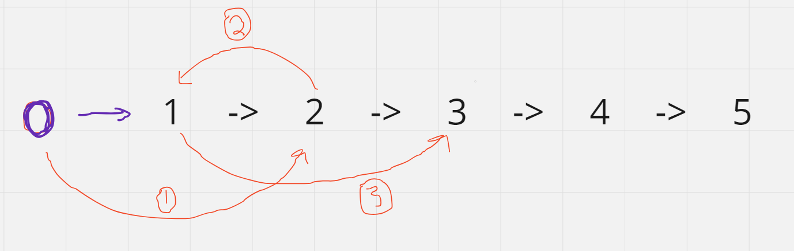

# 24. Swap Nodes in Pairs

## Link to the questions

[24. Swap Nodes in Pairs](https://leetcode.com/problems/swap-nodes-in-pairs/description/)

## Question description

Given a linked list, swap every two adjacent nodes and return its head. You must solve the problem without modifying the values in the list's nodes (i.e., only nodes themselves may be changed.)

```
Example 1:
    Input: head = [1,2,3,4]
    Output: [2,1,4,3]

Example 2:
    Input: head = []
    Output: []

Example 3:
    Input: head = [1]
    Output: [1]
```


And the constrains are:
 - The number of nodes in the list is in the range [0, 100].
 - 0 <= Node.val <= 100

## Problem solving thought process

Keep in mind that this question is a singly linked list. So we will need more than 1 pointer for tracking the elements.

The general logic is below:



## Code and Explanation
```java
public ListNode swapPairs(ListNode head) {
        ListNode dummy = new ListNode();
        dummy.next = head;

        ListNode left = dummy;

        while(left.next!=null && left.next.next!=null){
            ListNode temp = head.next.next; 
            left.next = head.next;
            head.next.next = head;
            head.next = temp;
            left = head;
            head = head.next;
        }

        return dummy.next;

    }
```

Complexity:
Time - O(N)
Space - O(1)